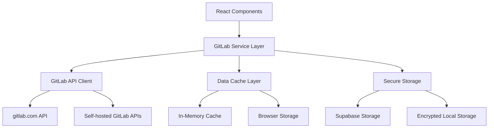
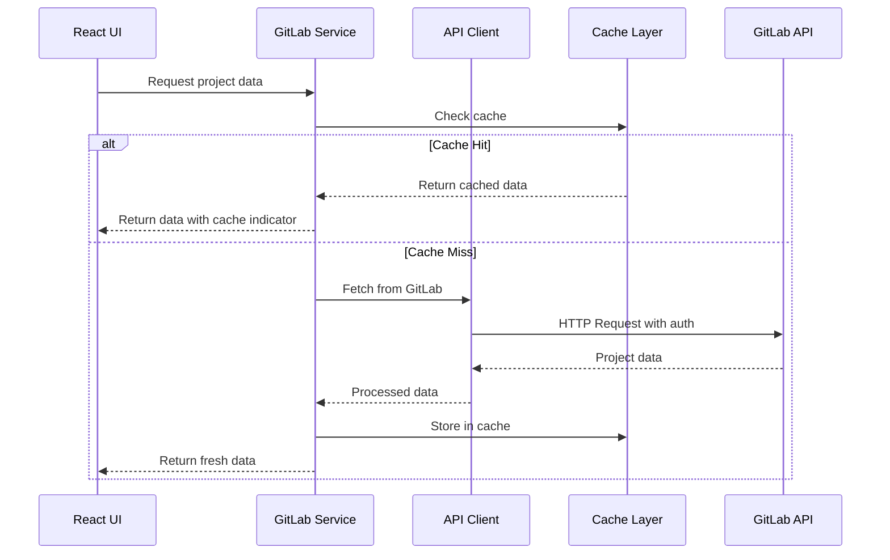

# Design Document

## Overview

The GitLab API integration feature will provide comprehensive connectivity to GitLab instances (both gitlab.com and self-hosted) to fetch and monitor repository data. The system will implement secure token-based authentication, efficient API rate limiting, real-time data synchronization, and a robust caching mechanism to ensure optimal performance and reliability.

## Architecture

### High-Level Architecture



### Data Flow Architecture



## Components and Interfaces

### 1. GitLab Service Layer

**Primary Interface: `GitLabService`**

```typescript
interface GitLabService {
  // Connection management
  validateConnection(instance: GitlabInstance): Promise<ValidationResult>;
  testApiAccess(instance: GitlabInstance): Promise<boolean>;
  
  // Project operations
  fetchProjects(instanceId: string, options?: FetchOptions): Promise<GitlabProject[]>;
  fetchProjectDetails(instanceId: string, projectId: number): Promise<GitlabProjectDetails>;
  refreshProjectData(instanceId: string, projectIds?: number[]): Promise<void>;
  
  // Real-time updates
  startPolling(instanceId: string, interval?: number): void;
  stopPolling(instanceId: string): void;
  
  // Cache management
  clearCache(instanceId?: string): void;
  getCacheStats(): CacheStats;
}
```

### 2. GitLab API Client

**Core Interface: `GitLabApiClient`**

```typescript
interface GitLabApiClient {
  // HTTP operations with rate limiting
  get<T>(endpoint: string, options?: ApiRequestOptions): Promise<ApiResponse<T>>;
  post<T>(endpoint: string, data: unknown, options?: ApiRequestOptions): Promise<ApiResponse<T>>;
  
  // Rate limiting
  checkRateLimit(): Promise<RateLimitInfo>;
  waitForRateLimit(): Promise<void>;
  
  // Authentication
  setAuthToken(token: string): void;
  validateToken(): Promise<boolean>;
}
```

### 3. Enhanced Data Models

**Extended GitLab Types:**

```typescript
interface GitlabProjectDetails extends GitlabProject {
  // Repository information
  webUrl: string;
  sshUrl: string;
  httpUrl: string;
  starCount: number;
  forkCount: number;
  
  // Activity metrics
  commitCount: number;
  lastActivityAt: Date;
  
  // Issue and MR details
  openIssuesCount: number;
  openMergeRequestsCount: number;
  
  // Branch information
  defaultBranch: string;
  branchCount: number;
  
  // Latest commit info
  lastCommit?: {
    id: string;
    message: string;
    authorName: string;
    authorEmail: string;
    committedDate: Date;
    webUrl: string;
  };
  
  // Pipeline status
  pipelineStatus?: 'success' | 'failed' | 'running' | 'pending' | 'canceled' | 'skipped';
  
  // Permissions
  permissions: {
    projectAccess?: number;
    groupAccess?: number;
  };
}

interface GitlabApiConfig {
  baseUrl: string;
  token: string;
  version: 'v4'; // GitLab API version
  timeout: number;
  retryAttempts: number;
  retryDelay: number;
}

interface RateLimitInfo {
  limit: number;
  remaining: number;
  resetTime: Date;
  retryAfter?: number;
}

interface FetchOptions {
  page?: number;
  perPage?: number;
  orderBy?: 'id' | 'name' | 'path' | 'created_at' | 'updated_at' | 'last_activity_at';
  sort?: 'asc' | 'desc';
  search?: string;
  visibility?: 'private' | 'internal' | 'public';
  owned?: boolean;
  membership?: boolean;
  starred?: boolean;
  statistics?: boolean;
  withIssuesEnabled?: boolean;
  withMergeRequestsEnabled?: boolean;
}
```

## Data Models

### 1. Enhanced Settings Structure

```typescript
interface GitlabSettings {
  instances: GitlabInstance[];
  refreshInterval: number; // in minutes
  maxProjects: number;
  cacheTimeout: number; // in minutes
  enableRealTimeUpdates: boolean;
  defaultFetchOptions: FetchOptions;
  rateLimitBuffer: number; // percentage buffer for rate limits
}

interface GitlabInstance {
  id: string;
  name: string;
  url: string;
  token: string; // encrypted in storage
  description?: string;
  isActive: boolean;
  lastChecked?: Date;
  apiVersion: string;
  connectionStatus: 'connected' | 'disconnected' | 'error' | 'checking';
  errorMessage?: string;
  rateLimitInfo?: RateLimitInfo;
  selectedProjects: number[]; // IDs of projects to monitor
  fetchOptions: FetchOptions;
}
```

### 2. Cache Data Structure

```typescript
interface GitlabCacheEntry {
  instanceId: string;
  projectId: number;
  data: GitlabProjectDetails;
  timestamp: Date;
  expiresAt: Date;
  etag?: string; // for HTTP caching
}

interface GitlabCacheManager {
  get(instanceId: string, projectId: number): GitlabCacheEntry | null;
  set(instanceId: string, projectId: number, data: GitlabProjectDetails, ttl?: number): void;
  invalidate(instanceId: string, projectId?: number): void;
  cleanup(): void;
  getStats(): CacheStats;
}
```

## Error Handling

### 1. Error Classification

```typescript
enum GitlabErrorType {
  AUTHENTICATION_ERROR = 'AUTHENTICATION_ERROR',
  RATE_LIMIT_EXCEEDED = 'RATE_LIMIT_EXCEEDED',
  NETWORK_ERROR = 'NETWORK_ERROR',
  API_ERROR = 'API_ERROR',
  VALIDATION_ERROR = 'VALIDATION_ERROR',
  PERMISSION_ERROR = 'PERMISSION_ERROR',
  INSTANCE_UNREACHABLE = 'INSTANCE_UNREACHABLE'
}

interface GitlabError extends Error {
  type: GitlabErrorType;
  instanceId?: string;
  statusCode?: number;
  retryAfter?: number;
  details?: Record<string, unknown>;
}
```

### 2. Error Recovery Strategies

- **Authentication Errors**: Prompt user to re-enter token, clear cached credentials
- **Rate Limit Errors**: Implement exponential backoff with jitter, queue requests
- **Network Errors**: Retry with exponential backoff, show offline indicator
- **API Errors**: Log for debugging, show user-friendly messages
- **Permission Errors**: Inform user about access limitations, suggest solutions

### 3. Graceful Degradation

- Show cached data when API is unavailable
- Display staleness indicators for old data
- Provide manual refresh options
- Maintain partial functionality during outages

## Testing Strategy

### 1. Unit Testing

**Service Layer Tests:**
- GitLab API client functionality
- Rate limiting logic
- Cache management
- Error handling scenarios
- Token validation

**Component Tests:**
- GitLab project cards rendering
- Settings form validation
- Connection status indicators
- Loading states and error boundaries

### 2. Integration Testing

**API Integration Tests:**
- Real GitLab API connectivity (with test tokens)
- Rate limiting behavior
- Pagination handling
- Error response handling

**End-to-End Tests:**
- Complete user workflow from setup to monitoring
- Multi-instance configuration
- Project selection and monitoring
- Real-time updates

### 3. Performance Testing

**Load Testing:**
- Multiple concurrent API requests
- Large project lists rendering
- Cache performance under load
- Memory usage optimization

**Network Testing:**
- Slow network conditions
- Intermittent connectivity
- API timeout scenarios

### 4. Security Testing

**Token Security:**
- Encryption/decryption of stored tokens
- Token exposure prevention in logs
- Secure transmission of credentials

**API Security:**
- HTTPS enforcement
- Request signing validation
- Input sanitization

## Implementation Phases

### Phase 1: Core API Integration
- Basic GitLab API client
- Token-based authentication
- Simple project fetching
- Basic error handling

### Phase 2: Advanced Features
- Rate limiting implementation
- Caching layer
- Real-time updates
- Multi-instance support

### Phase 3: UI Enhancement
- Enhanced project cards
- Advanced filtering
- Settings management
- Status indicators

### Phase 4: Optimization
- Performance improvements
- Advanced caching strategies
- Background sync
- Offline support

## Security Considerations

### 1. Token Storage
- Encrypt tokens before storing in Supabase
- Use browser's crypto API for local encryption
- Implement token rotation support
- Clear tokens on logout/disconnect

### 2. API Communication
- Enforce HTTPS for all API calls
- Validate SSL certificates
- Implement request signing where applicable
- Sanitize all user inputs

### 3. Data Privacy
- Minimize data collection
- Implement data retention policies
- Provide data export/deletion options
- Comply with privacy regulations

### 4. Access Control
- Validate user permissions before API calls
- Implement role-based access to GitLab features
- Audit API access and usage
- Rate limit per-user API calls

## Performance Optimization

### 1. Caching Strategy
- Multi-level caching (memory + storage)
- ETags for HTTP caching
- Intelligent cache invalidation
- Background cache warming

### 2. API Efficiency
- Batch API requests where possible
- Use GraphQL API when available
- Implement request deduplication
- Optimize pagination strategies

### 3. UI Performance
- Virtual scrolling for large project lists
- Lazy loading of project details
- Debounced search and filtering
- Optimistic UI updates

### 4. Network Optimization
- Request compression
- Connection pooling
- Retry with exponential backoff
- Circuit breaker pattern for failing instances
